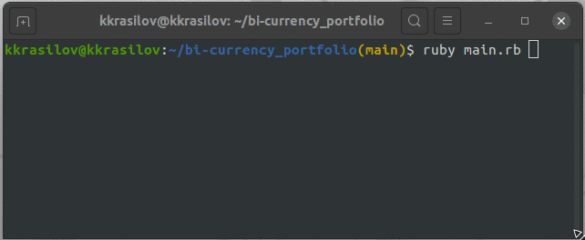

# bi-currency_portfolio

## Описание

Программа узнает текущий курс доллара с сайта [Центрального Банка России](https://www.cbr.ru/currency_base/daily/), сравнивает валюты и уравновешивает Ваши сбережения!

## Preview



## Установка

Для корректной работы программы на вашем компьютере должен быть установлен [Ruby MRI](https://www.ruby-lang.org/en/).

```
$ git clone https://github.com/kkrasilov/bi-currency_portfolio.git
$ cd ./bi-currency_portfolio
```

## Запуск

Запуск осуществляется командой

```
$ ruby main.rb
